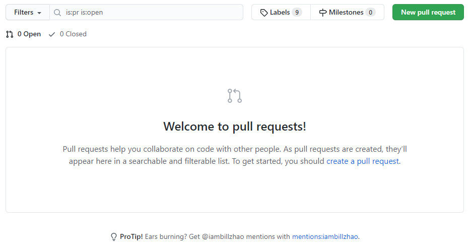
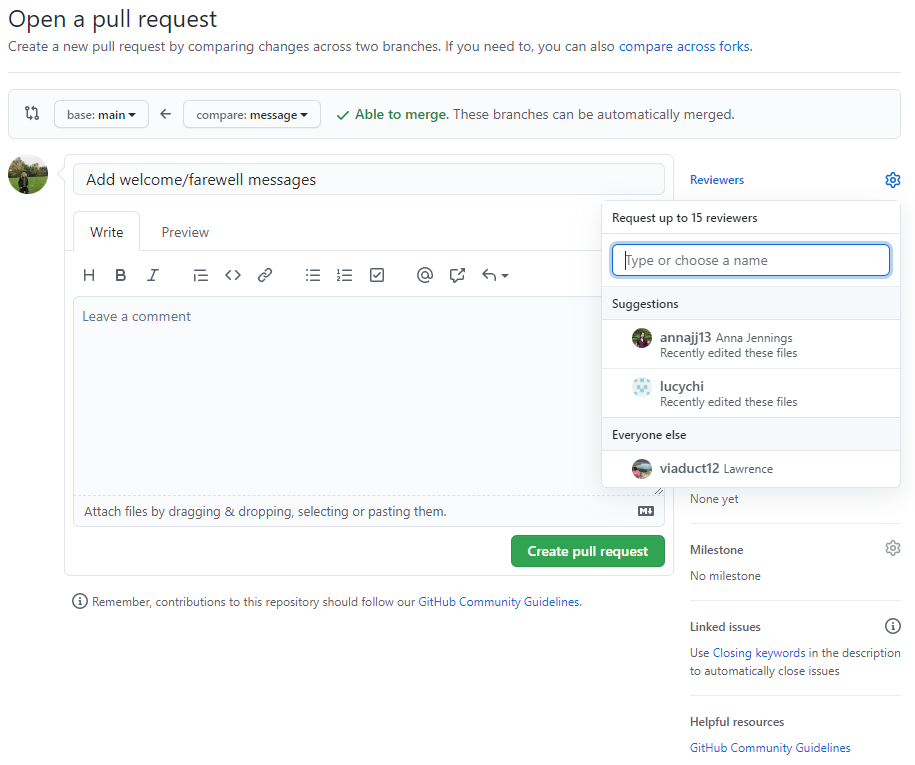

# Hardware Pirates' Disassembler

## Overview

CSS 422 Final Project

## Workflow

### Getting Started

1. Checkout the main branch using `git checkout main`.

2. Create a new branch using `git checkout -b <new_name>`. Example: `iambillzhao/start`.

3. Push the new branch to GitHub using `git push --set-upstrea, origin <new_name>`.

### Making a Pull Request

1. Merge changes from the main branch to your new branch using `git merge main`.

2. Head to this [repository](https://github.com/iambillzhao/Movie-Store) and go to the tab named "Pull Requests".

3. Click on "New pull request", find your pushed branch in "Example comparisons", then "Create pull requests".

5. If your pull request is associated with an issue, include `Close #<issue_name>` in your pull request description. This will automatically close that issue once your pull request is approved.

6. Request a review from collaborators.

